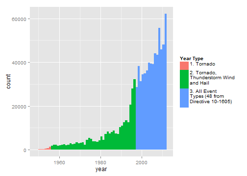
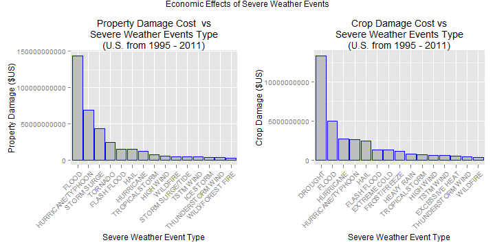
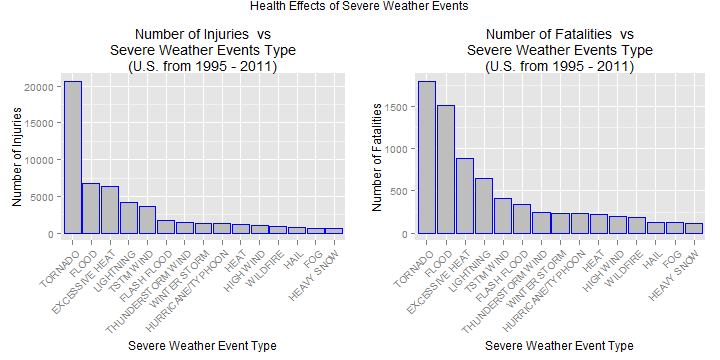

Reproducible Research: Peer Assessment 2
==========================================
Created by Simon Mackinnon on January 15, 2015
[Reproducable Research - Coursera](https://www.coursera.org/course/repdata)

## Economic and Public Health Effects of Storms and Other Severe Weather Events 

### Synopsis

The aim of this report is to analyse the storm database collected via the U.S. National Oceanic and Atmospheric Administration's (NOAA) from 1950 - 2011, and conclude the economic and health effects of different severe weather event types.  
The recorded data lists the number of fatalities, injuries, property and crop damage. These will be used to decide which types of event are most harmful to the population health and economy.  
In analysing the data, it was found that **tornadoes have the greatest detrimental effect on population health** and that **flood and drought have the greatest detremental economic effect**.  


### Settings

```r
options(scipen = 999) 
library(R.utils)
library(lubridate)
library(dplyr)
library(ggplot2)
library(grid)
library(gridExtra)
library(lazyeval)
```

### Data Processing
The data to be used for this analysis is available for download via the course website at [Storm Data](https://d396qusza40orc.cloudfront.net/repdata%2Fdata%2FStormData.csv.bz2).    


```r
zip_filename <- "./data/repdata-data-StormData.csv.bz2"
data_filename <- "./data/repdata-data-StormData.csv"

if (!file.exists("./data"))
{
  dir.create("./data")
}

if (!file.exists(data_filename))
{
  if (!file.exists(zip_filename))
  {
    url <- "http://d396qusza40orc.cloudfront.net/repdata%2Fdata%2FStormData.csv.bz2"
    #record the time/location of the downloaded file
    print (paste("Downloading file from:", url ,"at:", format(Sys.Date(), "%B %d, %Y"), format(Sys.time(), "%H:%M:%S")))
    #changed url to be http, as download file has issues with https
    
    download.file(url, 
                  destfile = zip_filename,
                  mode="wb")
  }
  
  bunzip2(zip_filename, overwrite=T, remove=F)
}

print (paste("Extracted data file information.", "Created on:", format(file.info(data_filename)$ctime, "%B %d, %Y %H:%M:%S"), "Modified on: ", format(file.info(data_filename)$mtime, "%B %d, %Y %H:%M:%S")))
```

```
## [1] "Extracted data file information. Created on: January 13, 2015 15:31:37 Modified on:  January 13, 2015 15:31:49"
```

We now read the .csv into R.


```r
# this may take some time!
stormData <- read.csv(data_filename, 
                      header=TRUE, 
                      sep=",",
                      stringsAsFactors=FALSE)

#confirm the number dimensions of the read data
dim(stormData)
```

```
## [1] 902297     37
```

```r
#and display the head rows
head(stormData)
```

```
##   STATE__           BGN_DATE BGN_TIME TIME_ZONE COUNTY COUNTYNAME STATE
## 1       1  4/18/1950 0:00:00     0130       CST     97     MOBILE    AL
## 2       1  4/18/1950 0:00:00     0145       CST      3    BALDWIN    AL
## 3       1  2/20/1951 0:00:00     1600       CST     57    FAYETTE    AL
## 4       1   6/8/1951 0:00:00     0900       CST     89    MADISON    AL
## 5       1 11/15/1951 0:00:00     1500       CST     43    CULLMAN    AL
## 6       1 11/15/1951 0:00:00     2000       CST     77 LAUDERDALE    AL
##    EVTYPE BGN_RANGE BGN_AZI BGN_LOCATI END_DATE END_TIME COUNTY_END
## 1 TORNADO         0                                               0
## 2 TORNADO         0                                               0
## 3 TORNADO         0                                               0
## 4 TORNADO         0                                               0
## 5 TORNADO         0                                               0
## 6 TORNADO         0                                               0
##   COUNTYENDN END_RANGE END_AZI END_LOCATI LENGTH WIDTH F MAG FATALITIES
## 1         NA         0                      14.0   100 3   0          0
## 2         NA         0                       2.0   150 2   0          0
## 3         NA         0                       0.1   123 2   0          0
## 4         NA         0                       0.0   100 2   0          0
## 5         NA         0                       0.0   150 2   0          0
## 6         NA         0                       1.5   177 2   0          0
##   INJURIES PROPDMG PROPDMGEXP CROPDMG CROPDMGEXP WFO STATEOFFIC ZONENAMES
## 1       15    25.0          K       0                                    
## 2        0     2.5          K       0                                    
## 3        2    25.0          K       0                                    
## 4        2     2.5          K       0                                    
## 5        2     2.5          K       0                                    
## 6        6     2.5          K       0                                    
##   LATITUDE LONGITUDE LATITUDE_E LONGITUDE_ REMARKS REFNUM
## 1     3040      8812       3051       8806              1
## 2     3042      8755          0          0              2
## 3     3340      8742          0          0              3
## 4     3458      8626          0          0              4
## 5     3412      8642          0          0              5
## 6     3450      8748          0          0              6
```
There are **902297 rows** and **37 columns** in the read data.


### Data Selection and Filtering

Looking at the details of how the data was collected at the [Storm Events Database](http://www.ncdc.noaa.gov/stormevents/details.jsp), we can see that only observations from 1996 onward includes data from *All Event Types (48 from Directive 10-1605)*, (as defined in [NWS Directive 10-1605](http://www.ncdc.noaa.gov/stormevents/pd01016005curr.pdf)).  

We can verify that most of the observations were recorded after this date as well, by observing the frequency of observations per year in the **stormData$BGN_DATE** variable


```r
year <- year(as.Date(stormData$BGN_DATE, format = "%m/%d/%Y"))

#break up the year data into 3 types
yearType <- sapply(as.numeric(year), function(x) 
    if (x >= 1950 & x <= 1955){1} 
    else if (x <= 1996) {2} 
    else if (x <= 2011) {3}
    else {0})

#bind into a marix, then coerce to a data frame
yearData <- data.frame(cbind(year, yearType))

#create the histogram
ggplot(yearData, aes(x=year)) + 
geom_histogram(binwidth = 1, 
               aes(fill = factor(yearData$yearType)),
               colour = "black") +
scale_fill_discrete(name="Year Type", 
                    labels= c("1. Tornado\n1950-1955\n",
                              "2. Tornado,\nThunderstorm Wind\nand Hail\n1956-1995\n",
                              "3. All Event\nTypes (48 from\nDirective 10-1605)\n1996-2011")) +
labs(title = "Histogram of Number of\nObservarions Recorded Per Year (1950 - 2011)",
     x = "Year",
     y = "Number of Observations Recorded")
```



Based on this, we filter the data to only use observations from 1996 onward.


```r
#append the year values for filtering
stormData$year <- year
#subset the data for all values of year greater or equal to 1996
stormData <- stormData[stormData$year >= 1996,]
#display the dimensions of the filtered data
dim(stormData)
```

```
## [1] 653530     38
```
After filtering, there are **653530 rows** and **38 columns** in the filtered data.

### Results

#### Event Type Analysis

In order to perform an anlysis on the health and economic effects of different severe weather event types, we should first illustrate a proper understanding of the different types of events.


```r
eventTypeList <- unique(stormData$EVTYPE)
eventTypeList
```

```
##   [1] "WINTER STORM"                   "TORNADO"                       
##   [3] "TSTM WIND"                      "HAIL"                          
##   [5] "HIGH WIND"                      "HEAVY RAIN"                    
##   [7] "FLASH FLOOD"                    "FREEZING RAIN"                 
##   [9] "EXTREME COLD"                   "EXCESSIVE HEAT"                
##  [11] "LIGHTNING"                      "FUNNEL CLOUD"                  
##  [13] "EXTREME WINDCHILL"              "BLIZZARD"                      
##  [15] "URBAN/SML STREAM FLD"           "FLOOD"                         
##  [17] "TSTM WIND/HAIL"                 "WATERSPOUT"                    
##  [19] "RIP CURRENTS"                   "HEAVY SNOW"                    
##  [21] "Other"                          "Record dry month"              
##  [23] "Temperature record"             "WILD/FOREST FIRE"              
##  [25] "Minor Flooding"                 "ICE STORM"                     
##  [27] "STORM SURGE"                    "Ice jam flood (minor"          
##  [29] "High Wind"                      "DUST STORM"                    
##  [31] "STRONG WIND"                    "DUST DEVIL"                    
##  [33] "Tstm Wind"                      "DROUGHT"                       
##  [35] "DRY MICROBURST"                 "FOG"                           
##  [37] "ROUGH SURF"                     "Wind"                          
##  [39] "THUNDERSTORMS"                  "Heavy Surf"                    
##  [41] "HEAVY SURF"                     "Dust Devil"                    
##  [43] "Wind Damage"                    "Marine Accident"               
##  [45] "Snow"                           "AVALANCHE"                     
##  [47] "Freeze"                         "TROPICAL STORM"                
##  [49] "Snow Squalls"                   "Coastal Flooding"              
##  [51] "Heavy Rain"                     "Strong Wind"                   
##  [53] "WINDS"                          "WIND"                          
##  [55] "COASTAL FLOOD"                  "COASTAL STORM"                 
##  [57] "COASTALFLOOD"                   "Erosion/Cstl Flood"            
##  [59] "Heavy Rain and Wind"            "Light Snow/Flurries"           
##  [61] "Wet Month"                      "Wet Year"                      
##  [63] "Tidal Flooding"                 "River Flooding"                
##  [65] "SNOW"                           "DAMAGING FREEZE"               
##  [67] "Damaging Freeze"                "HURRICANE"                     
##  [69] "Beach Erosion"                  "Hot and Dry"                   
##  [71] "Flood/Flash Flood"              "Icy Roads"                     
##  [73] "High Surf"                      "Heavy Rain/High Surf"          
##  [75] "HIGH SURF"                      "Thunderstorm Wind"             
##  [77] "Rain Damage"                    "ICE JAM"                       
##  [79] "Unseasonable Cold"              "Early Frost"                   
##  [81] "Wintry Mix"                     "blowing snow"                  
##  [83] "STREET FLOODING"                "Record Cold"                   
##  [85] "Extreme Cold"                   "Ice Fog"                       
##  [87] "Excessive Cold"                 "Torrential Rainfall"           
##  [89] "Freezing Rain"                  "Landslump"                     
##  [91] "Late-season Snowfall"           "Hurricane Edouard"             
##  [93] "Coastal Storm"                  "Flood"                         
##  [95] "HEAVY RAIN/WIND"                "TIDAL FLOODING"                
##  [97] "Winter Weather"                 "Snow squalls"                  
##  [99] "Strong Winds"                   "Strong winds"                  
## [101] "RECORD WARM TEMPS."             "Ice/Snow"                      
## [103] "Mudslide"                       "Glaze"                         
## [105] "Extended Cold"                  "Snow Accumulation"             
## [107] "Freezing Fog"                   "Drifting Snow"                 
## [109] "Whirlwind"                      "Heavy snow shower"             
## [111] "Heavy rain"                     "COASTAL FLOODING"              
## [113] "LATE SNOW"                      "Record May Snow"               
## [115] "Record Winter Snow"             "Heavy Precipitation"           
## [117] " COASTAL FLOOD"                 "Record temperature"            
## [119] "Light snow"                     "Late Season Snowfall"          
## [121] "Gusty Wind"                     "small hail"                    
## [123] "Light Snow"                     "MIXED PRECIP"                  
## [125] "Black Ice"                      "Mudslides"                     
## [127] "Gradient wind"                  "Snow and Ice"                  
## [129] "COLD"                           "Freezing Spray"                
## [131] "DOWNBURST"                      "Summary Jan 17"                
## [133] "Summary of March 14"            "Summary of March 23"           
## [135] "Summary of March 24"            "Summary of April 3rd"          
## [137] "Summary of April 12"            "Summary of April 13"           
## [139] "Summary of April 21"            "Summary August 11"             
## [141] "Summary of April 27"            "Summary of May 9-10"           
## [143] "Summary of May 10"              "Summary of May 13"             
## [145] "Summary of May 14"              "Summary of May 22 am"          
## [147] "Summary of May 22 pm"           "Heatburst"                     
## [149] "Summary of May 26 am"           "Summary of May 26 pm"          
## [151] "Metro Storm, May 26"            "Summary of May 31 am"          
## [153] "Summary of May 31 pm"           "Summary of June 3"             
## [155] "Summary of June 4"              "Summary June 5-6"              
## [157] "Summary June 6"                 "Summary of June 11"            
## [159] "Summary of June 12"             "Summary of June 13"            
## [161] "Summary of June 15"             "Summary of June 16"            
## [163] "Summary June 18-19"             "Summary of June 23"            
## [165] "Summary of June 24"             "Summary of June 30"            
## [167] "Summary of July 2"              "Summary of July 3"             
## [169] "Summary of July 11"             "Summary of July 22"            
## [171] "Summary July 23-24"             "Summary of July 26"            
## [173] "Summary of July 29"             "Summary of August 1"           
## [175] "Summary August 2-3"             "Summary August 7"              
## [177] "Summary August 9"               "Summary August 10"             
## [179] "Summary August 17"              "Summary August 21"             
## [181] "Summary August 28"              "Summary September 4"           
## [183] "Summary September 20"           "Summary September 23"          
## [185] "Summary Sept. 25-26"            "Summary: Oct. 20-21"           
## [187] "Summary: October 31"            "Summary: Nov. 6-7"             
## [189] "Summary: Nov. 16"               "Microburst"                    
## [191] "wet micoburst"                  "HAIL/WIND"                     
## [193] "Hail(0.75)"                     "Funnel Cloud"                  
## [195] "Urban Flooding"                 "No Severe Weather"             
## [197] "Urban flood"                    "Urban Flood"                   
## [199] "Cold"                           "WINTER WEATHER"                
## [201] "Summary of May 22"              "Summary of June 6"             
## [203] "Summary August 4"               "Summary of June 10"            
## [205] "Summary of June 18"             "Summary September 3"           
## [207] "Summary: Sept. 18"              "Coastal Flood"                 
## [209] "coastal flooding"               "Small Hail"                    
## [211] "Record Temperatures"            "Light Snowfall"                
## [213] "Freezing Drizzle"               "Gusty wind/rain"               
## [215] "GUSTY WIND/HVY RAIN"            "Blowing Snow"                  
## [217] "Early snowfall"                 "Monthly Snowfall"              
## [219] "Record Heat"                    "Seasonal Snowfall"             
## [221] "Monthly Rainfall"               "Cold Temperature"              
## [223] "Sml Stream Fld"                 "Heat Wave"                     
## [225] "MUDSLIDE/LANDSLIDE"             "Saharan Dust"                  
## [227] "Volcanic Ash"                   "Volcanic Ash Plume"            
## [229] "Thundersnow shower"             "NONE"                          
## [231] "COLD AND SNOW"                  "DAM BREAK"                     
## [233] "RAIN"                           "RAIN/SNOW"                     
## [235] "OTHER"                          "FREEZE"                        
## [237] "TSTM WIND (G45)"                "RECORD WARMTH"                 
## [239] "STRONG WINDS"                   "FREEZING DRIZZLE"              
## [241] "UNSEASONABLY WARM"              "SLEET/FREEZING RAIN"           
## [243] "BLACK ICE"                      "WINTRY MIX"                    
## [245] "BLOW-OUT TIDES"                 "UNSEASONABLY COLD"             
## [247] "UNSEASONABLY COOL"              "TSTM HEAVY RAIN"               
## [249] "UNSEASONABLY DRY"               "Gusty Winds"                   
## [251] "GUSTY WIND"                     "TSTM WIND 40"                  
## [253] "TSTM WIND 45"                   "HARD FREEZE"                   
## [255] "TSTM WIND (41)"                 "HEAT"                          
## [257] "RIVER FLOOD"                    "TSTM WIND (G40)"               
## [259] "RIP CURRENT"                    "TSTM WND"                      
## [261] "DENSE FOG"                      "Wintry mix"                    
## [263] " TSTM WIND"                     "MUD SLIDE"                     
## [265] "MUDSLIDES"                      "MUDSLIDE"                      
## [267] "Frost"                          "Frost/Freeze"                  
## [269] "SNOW AND ICE"                   "WIND DAMAGE"                   
## [271] "RAIN (HEAVY)"                   "Record Warmth"                 
## [273] "Prolong Cold"                   "Cold and Frost"                
## [275] "RECORD COLD"                    "PROLONG COLD"                  
## [277] "AGRICULTURAL FREEZE"            "URBAN/SML STREAM FLDG"         
## [279] "SNOW SQUALL"                    "HEAVY SNOW SQUALLS"            
## [281] "SNOW/ICE"                       "GUSTY WINDS"                   
## [283] "SMALL HAIL"                     "SNOW SQUALLS"                  
## [285] "LAKE EFFECT SNOW"               "STRONG WIND GUST"              
## [287] "LATE FREEZE"                    "RECORD TEMPERATURES"           
## [289] "ICY ROADS"                      "RECORD SNOWFALL"               
## [291] "BLOW-OUT TIDE"                  "THUNDERSTORM"                  
## [293] "Hypothermia/Exposure"           "HYPOTHERMIA/EXPOSURE"          
## [295] "Lake Effect Snow"               "Mixed Precipitation"           
## [297] "Record High"                    "COASTALSTORM"                  
## [299] "LIGHT SNOW"                     "Snow and sleet"                
## [301] "Freezing rain"                  "Gusty winds"                   
## [303] "FUNNEL CLOUDS"                  "WATERSPOUTS"                   
## [305] "Blizzard Summary"               "FROST"                         
## [307] "ICE"                            "SUMMARY OF MARCH 24-25"        
## [309] "SUMMARY OF MARCH 27"            "SUMMARY OF MARCH 29"           
## [311] "GRADIENT WIND"                  "Icestorm/Blizzard"             
## [313] "Flood/Strong Wind"              "TSTM WIND AND LIGHTNING"       
## [315] "gradient wind"                  "SEVERE THUNDERSTORMS"          
## [317] "EXCESSIVE RAIN"                 "Freezing drizzle"              
## [319] "Mountain Snows"                 "URBAN/SMALL STRM FLDG"         
## [321] "WET MICROBURST"                 "Heavy surf and wind"           
## [323] "Mild and Dry Pattern"           "COLD AND FROST"                
## [325] "RECORD HEAT"                    "TYPHOON"                       
## [327] "LANDSLIDES"                     "HIGH SWELLS"                   
## [329] "HIGH  SWELLS"                   "VOLCANIC ASH"                  
## [331] "HIGH WINDS"                     "DRY SPELL"                     
## [333] " LIGHTNING"                     "BEACH EROSION"                 
## [335] "UNSEASONAL RAIN"                "EARLY RAIN"                    
## [337] "PROLONGED RAIN"                 "WINTERY MIX"                   
## [339] "COASTAL FLOODING/EROSION"       "UNSEASONABLY WET"              
## [341] "HOT SPELL"                      "HEAT WAVE"                     
## [343] "UNSEASONABLY HOT"               "UNSEASONABLY WARM AND DRY"     
## [345] " TSTM WIND (G45)"               "TSTM WIND  (G45)"              
## [347] "HIGH WIND (G40)"                "TSTM WIND (G35)"               
## [349] "DRY WEATHER"                    "TSTM WINDS"                    
## [351] "FREEZING RAIN/SLEET"            "ABNORMAL WARMTH"               
## [353] "UNUSUAL WARMTH"                 "GLAZE"                         
## [355] "WAKE LOW WIND"                  "MONTHLY RAINFALL"              
## [357] "COLD TEMPERATURES"              "COLD WIND CHILL TEMPERATURES"  
## [359] "MODERATE SNOW"                  "MODERATE SNOWFALL"             
## [361] "URBAN/STREET FLOODING"          "COASTAL EROSION"               
## [363] "UNUSUAL/RECORD WARMTH"          "BITTER WIND CHILL"             
## [365] "BITTER WIND CHILL TEMPERATURES" "SEICHE"                        
## [367] "TSTM"                           "COASTAL  FLOODING/EROSION"     
## [369] "SNOW DROUGHT"                   "UNSEASONABLY WARM YEAR"        
## [371] "HYPERTHERMIA/EXPOSURE"          "SNOW/SLEET"                    
## [373] "ROCK SLIDE"                     "ICE PELLETS"                   
## [375] "URBAN FLOOD"                    "PATCHY DENSE FOG"              
## [377] "RECORD COOL"                    "RECORD WARM"                   
## [379] "HOT WEATHER"                    "RIVER FLOODING"                
## [381] "RECORD TEMPERATURE"             "SAHARAN DUST"                  
## [383] "TROPICAL DEPRESSION"            "VOLCANIC ERUPTION"             
## [385] "COOL SPELL"                     "WIND ADVISORY"                 
## [387] "GUSTY WIND/HAIL"                "RED FLAG FIRE WX"              
## [389] "FIRST FROST"                    "EXCESSIVELY DRY"               
## [391] "HEAVY SEAS"                     "FLASH FLOOD/FLOOD"             
## [393] "SNOW AND SLEET"                 "LIGHT SNOW/FREEZING PRECIP"    
## [395] "VOG"                            "EXCESSIVE RAINFALL"            
## [397] "FLASH FLOODING"                 "MONTHLY PRECIPITATION"         
## [399] "MONTHLY TEMPERATURE"            "RECORD DRYNESS"                
## [401] "EXTREME WINDCHILL TEMPERATURES" "MIXED PRECIPITATION"           
## [403] "EXTREME WIND CHILL"             "DRY CONDITIONS"                
## [405] "HEAVY RAINFALL"                 "REMNANTS OF FLOYD"             
## [407] "EARLY SNOWFALL"                 "FREEZING FOG"                  
## [409] "LANDSPOUT"                      "DRIEST MONTH"                  
## [411] "RECORD  COLD"                   "LATE SEASON HAIL"              
## [413] "EXCESSIVE SNOW"                 "WINTER MIX"                    
## [415] "DRYNESS"                        "FLOOD/FLASH/FLOOD"             
## [417] "WIND AND WAVE"                  "SEVERE THUNDERSTORM"           
## [419] "LIGHT FREEZING RAIN"            " WIND"                         
## [421] "MONTHLY SNOWFALL"               "DRY"                           
## [423] "RECORD RAINFALL"                "RECORD PRECIPITATION"          
## [425] "ICE ROADS"                      "HIGH SEAS"                     
## [427] "SLEET"                          "ROUGH SEAS"                    
## [429] "UNSEASONABLY WARM/WET"          "UNSEASONABLY COOL & WET"       
## [431] "UNUSUALLY WARM"                 "TSTM WIND G45"                 
## [433] "NON SEVERE HAIL"                "RECORD SNOW"                   
## [435] "SNOW/FREEZING RAIN"             "SNOW/BLOWING SNOW"             
## [437] "NON-SEVERE WIND DAMAGE"         "UNUSUALLY COLD"                
## [439] "WARM WEATHER"                   "LANDSLUMP"                     
## [441] "THUNDERSTORM WIND (G40)"        "LANDSLIDE"                     
## [443] "WALL CLOUD"                     "HIGH WATER"                    
## [445] "UNSEASONABLY WARM & WET"        " FLASH FLOOD"                  
## [447] "LOCALLY HEAVY RAIN"             "WIND GUSTS"                    
## [449] "UNSEASONAL LOW TEMP"            "HIGH SURF ADVISORY"            
## [451] "LATE SEASON SNOW"               "GUSTY LAKE WIND"               
## [453] "ABNORMALLY DRY"                 "WINTER WEATHER MIX"            
## [455] "RED FLAG CRITERIA"              "WND"                           
## [457] "CSTL FLOODING/EROSION"          "SMOKE"                         
## [459] " WATERSPOUT"                    "SNOW ADVISORY"                 
## [461] "EXTREMELY WET"                  "UNUSUALLY LATE SNOW"           
## [463] "VERY DRY"                       "RECORD LOW RAINFALL"           
## [465] "ROGUE WAVE"                     "SNOWMELT FLOODING"             
## [467] "PROLONG WARMTH"                 "ACCUMULATED SNOWFALL"          
## [469] "FALLING SNOW/ICE"               "DUST DEVEL"                    
## [471] "NON-TSTM WIND"                  "NON TSTM WIND"                 
## [473] "BRUSH FIRE"                     "GUSTY THUNDERSTORM WINDS"      
## [475] "PATCHY ICE"                     "SNOW SHOWERS"                  
## [477] "HEAVY RAIN EFFECTS"             "BLOWING DUST"                  
## [479] "EXCESSIVE HEAT/DROUGHT"         "NORTHERN LIGHTS"               
## [481] "MARINE TSTM WIND"               "   HIGH SURF ADVISORY"         
## [483] "WIND CHILL"                     "HAZARDOUS SURF"                
## [485] "WILDFIRE"                       "FROST/FREEZE"                  
## [487] "WINTER WEATHER/MIX"             "ASTRONOMICAL HIGH TIDE"        
## [489] "COLD WEATHER"                   "WHIRLWIND"                     
## [491] "VERY WARM"                      "ABNORMALLY WET"                
## [493] "TORNADO DEBRIS"                 "EXTREME COLD/WIND CHILL"       
## [495] "ICE ON ROAD"                    "FIRST SNOW"                    
## [497] "ICE/SNOW"                       "DROWNING"                      
## [499] "GUSTY THUNDERSTORM WIND"        "MARINE HAIL"                   
## [501] "HIGH SURF ADVISORIES"           "HURRICANE/TYPHOON"             
## [503] "HEAVY SURF/HIGH SURF"           "SLEET STORM"                   
## [505] "STORM SURGE/TIDE"               "COLD/WIND CHILL"               
## [507] "LAKE-EFFECT SNOW"               "MARINE HIGH WIND"              
## [509] "THUNDERSTORM WIND"              "TSUNAMI"                       
## [511] "DENSE SMOKE"                    "LAKESHORE FLOOD"               
## [513] "MARINE THUNDERSTORM WIND"       "MARINE STRONG WIND"            
## [515] "ASTRONOMICAL LOW TIDE"          "VOLCANIC ASHFALL"
```

From this, we can see there are **516** different defined event types. However, we can observe some problems with the way that the event types are recorded.  
In particular, we can see several types of severe weather that is defined by multiple EVTYPE values, e.g. Flood:


```r
floodList <- eventTypeList[grepl("flood", eventTypeList, ignore.case = TRUE)]
floodList
```

```
##  [1] "FLASH FLOOD"               "FLOOD"                    
##  [3] "Minor Flooding"            "Ice jam flood (minor"     
##  [5] "Coastal Flooding"          "COASTAL FLOOD"            
##  [7] "COASTALFLOOD"              "Erosion/Cstl Flood"       
##  [9] "Tidal Flooding"            "River Flooding"           
## [11] "Flood/Flash Flood"         "STREET FLOODING"          
## [13] "Flood"                     "TIDAL FLOODING"           
## [15] "COASTAL FLOODING"          " COASTAL FLOOD"           
## [17] "Urban Flooding"            "Urban flood"              
## [19] "Urban Flood"               "Coastal Flood"            
## [21] "coastal flooding"          "RIVER FLOOD"              
## [23] "Flood/Strong Wind"         "COASTAL FLOODING/EROSION" 
## [25] "URBAN/STREET FLOODING"     "COASTAL  FLOODING/EROSION"
## [27] "URBAN FLOOD"               "RIVER FLOODING"           
## [29] "FLASH FLOOD/FLOOD"         "FLASH FLOODING"           
## [31] "FLOOD/FLASH/FLOOD"         " FLASH FLOOD"             
## [33] "CSTL FLOODING/EROSION"     "SNOWMELT FLOODING"        
## [35] "LAKESHORE FLOOD"
```

From this, we can see there are **35** different event types that could be defined more broadly as 'flooding'. Other examples of this are tornadoes, cold, hot, dry, snow, fire, and others.  

Another problem with EVTYPE data is that there are many observations with "Summary of Month Date" recorded, instead of a definition of the event type.


```r
evtypeSummaryOfMonthDateList <- eventTypeList[grepl("summary of", eventTypeList, ignore.case = TRUE)]
evtypeSummaryOfMonthDateList
```

```
##  [1] "Summary of March 14"    "Summary of March 23"   
##  [3] "Summary of March 24"    "Summary of April 3rd"  
##  [5] "Summary of April 12"    "Summary of April 13"   
##  [7] "Summary of April 21"    "Summary of April 27"   
##  [9] "Summary of May 9-10"    "Summary of May 10"     
## [11] "Summary of May 13"      "Summary of May 14"     
## [13] "Summary of May 22 am"   "Summary of May 22 pm"  
## [15] "Summary of May 26 am"   "Summary of May 26 pm"  
## [17] "Summary of May 31 am"   "Summary of May 31 pm"  
## [19] "Summary of June 3"      "Summary of June 4"     
## [21] "Summary of June 11"     "Summary of June 12"    
## [23] "Summary of June 13"     "Summary of June 15"    
## [25] "Summary of June 16"     "Summary of June 23"    
## [27] "Summary of June 24"     "Summary of June 30"    
## [29] "Summary of July 2"      "Summary of July 3"     
## [31] "Summary of July 11"     "Summary of July 22"    
## [33] "Summary of July 26"     "Summary of July 29"    
## [35] "Summary of August 1"    "Summary of May 22"     
## [37] "Summary of June 6"      "Summary of June 10"    
## [39] "Summary of June 18"     "SUMMARY OF MARCH 24-25"
## [41] "SUMMARY OF MARCH 27"    "SUMMARY OF MARCH 29"
```

From this, we can see there are **42** observations where the event type was recorded as such. Exploring a little further, we can see how the observation was recorded in full.


```r
head(stormData[grepl("summary of", stormData$EVTYPE, ignore.case = TRUE),], 
           n=2)
```

```
##        STATE__          BGN_DATE    BGN_TIME TIME_ZONE COUNTY
## 269586      40 3/14/1996 0:00:00 11:15:00 AM       CST     12
## 269610      40 3/23/1996 0:00:00 04:15:00 PM       CST     11
##                        COUNTYNAME STATE              EVTYPE BGN_RANGE
## 269586       OKZ012>013 - 018>020    OK Summary of March 14         0
## 269610 OKZ011>012 - 014>018 - 036    OK Summary of March 23         0
##        BGN_AZI BGN_LOCATI          END_DATE    END_TIME COUNTY_END
## 269586                 CN 3/14/1996 0:00:00 05:00:00 PM          0
## 269610                    3/23/1996 0:00:00 08:30:00 PM          0
##        COUNTYENDN END_RANGE END_AZI END_LOCATI LENGTH WIDTH  F MAG
## 269586         NA         0                 CN      0     0 NA   0
## 269610         NA         0                         0     0 NA   0
##        FATALITIES INJURIES PROPDMG PROPDMGEXP CROPDMG CROPDMGEXP WFO
## 269586          0        0       0                  0            OUN
## 269610          0        0       0                  0            OUN
##                                      STATEOFFIC
## 269586 OKLAHOMA, Western, Central and Southeast
## 269610 OKLAHOMA, Western, Central and Southeast
##                                                                                      ZONENAMES
## 269586                                GARFIELD - GARFIELD - NOBLE - KINGFISHER - LOGAN - PAYNE
## 269610 MAJOR - MAJOR - GARFIELD - ROGER MILLS - DEWEY - CUSTER - BLAINE - KINGFISHER - JACKSON
##        LATITUDE LONGITUDE LATITUDE_E LONGITUDE_
## 269586        0         0          0          0
## 269610        0         0          0          0
##                                                                                                                                                                                                                                                       REMARKS
## 269586 Severe thunderstorms produced large hail as they moved across north-central Oklahoma during the late afternoon of the 14th. The largest hail was reported 1.5 miles north of Cushing in Payne County, where hail as large as half-dollars was sighted.
## 269610                                                                                      Severe thunderstorms moved across western Oklahoma, producing large hail.  Hail as large as baseballs was reported in Arapaho in Custer County with these storms.
##        REFNUM year
## 269586 269519 1996
## 269610 269610 1996
```

Upon this closer analysis, we can see that such instances have had the event type incorrectly recorded. The REMARKS column of the storm data contains a description of the event, which if needed, could be used to correctly populate the event type for such observations.

However, for the purposes of simple analysis, we will consider the EVTYPE values to be correct

#### Economic Effects

For the economic effects of severe weather, we must isolate what parts of the data define this.

Using the code book, ([Storm Events](http://ire.org/nicar/database-library/databases/storm-events/)), we can see that the columns PROPDMG and CROPDMG indicate the value of damage to property and crops respectively. Each of those columns is followed by a corresponding *EXP column, which indicates an exponent (H-Hundreds, K-Thousands, M-Millions, B-Billions). 

In order to aggregate the property and crop damage costs per event type, a common unit will need to be used (in this case, whole dollars.) In order to do this, two additional columns *propertyDamage* and *cropDamage* will be introduced, which will be the *DMG value multiplied by the appropriate *DMGEXP value.

From the following analysis, we can determine that **Flood** is the severe weather event type that has the greatest effect on the cost of Property Damage and that **Drought** has the greatest effect on the cost of Crop Damage.


```r
#subset data for crop damage cost, property damage cost (with exponents) and ev-type

stormDataEcon <- stormData[,c("EVTYPE", 
                              "PROPDMG", 
                              "PROPDMGEXP", 
                              "CROPDMG", 
                              "CROPDMGEXP")]

#create new vectors in the data frame
stormDataEcon$propertyDamage <- stormDataEcon$PROPDMG
stormDataEcon$cropDamage <- stormDataEcon$CROPDMG

#subset to rows only with damage
stormDataEcon <- stormDataEcon[stormDataEcon$PROPDMG != 0 | stormDataEcon$CROPDMG != 0,]

for (i in 1:nrow(stormDataEcon))
{
    if (stormDataEcon$PROPDMG[i] != 0)
    {
        if (stormDataEcon$PROPDMGEXP[i] == "H")
            stormDataEcon$propertyDamage[i] <- stormDataEcon$PROPDMG[i] * 10^2
        
        if (stormDataEcon$PROPDMGEXP[i] == "K")
            stormDataEcon$propertyDamage[i] <- stormDataEcon$PROPDMG[i] * 10^3
        
        if (stormDataEcon$PROPDMGEXP[i] == "M")
            stormDataEcon$propertyDamage[i] <- stormDataEcon$PROPDMG[i] * 10^6
        
        if (stormDataEcon$PROPDMGEXP[i] == "B")
            stormDataEcon$propertyDamage[i] <- stormDataEcon$PROPDMG[i] * 10^9    
    }
    
    if (stormDataEcon$CROPDMG[i] != 0)
    {
        if (stormDataEcon$CROPDMGEXP[i] == "H")
            stormDataEcon$cropDamage[i] <- stormDataEcon$CROPDMG[i] * 10^2
        
        if (stormDataEcon$CROPDMGEXP[i] == "K")
            stormDataEcon$cropDamage[i] <- stormDataEcon$CROPDMG[i] * 10^3
        
        if (stormDataEcon$CROPDMGEXP[i] == "M")
            stormDataEcon$cropDamage[i] <- stormDataEcon$CROPDMG[i] * 10^6
        
        if (stormDataEcon$CROPDMGEXP[i] == "B")
            stormDataEcon$cropDamage[i] <- stormDataEcon$CROPDMG[i] * 10^9
    }
}

#subset the relevant columns
stormDataEcon <- stormDataEcon[,c("EVTYPE",
                                  "propertyDamage",
                                  "cropDamage")]

stormDataEcon$EVTYPE <- factor(stormDataEcon$EVTYPE, 
                                   levels = stormDataEcon$EVTYPE)
```

```
## Warning in `levels<-`(`*tmp*`, value = if (nl == nL) as.character(labels)
## else paste0(labels, : duplicated levels in factors are deprecated
```

```r
#cost summation aggregrate by ev-type
economicImpactEventTypeAggregate <- aggregate(stormDataEcon,
                                              by = list(eventType = stormDataEcon$EVTYPE),
                                              FUN = function(x){sum(as.numeric(x))})

economicImpactEventTypeAggregate <- 
   economicImpactEventTypeAggregate[, c("eventType", 
                                        "propertyDamage",
                                        "cropDamage")]


#sort by totals
propertyDamageTop <- head(arrange(economicImpactEventTypeAggregate, 
                                             desc(propertyDamage)), 
                          n=15)

propertyDamageTop <- propertyDamageTop[,c("eventType", "propertyDamage")]
propertyDamageTop$eventType <- factor(propertyDamageTop$eventType, 
                                   levels = propertyDamageTop$eventType, 
                                   ordered = TRUE)

cropDamageTop <- head(arrange(economicImpactEventTypeAggregate, 
                                             desc(cropDamage)), 
                      n=15)

cropDamageTop <- cropDamageTop[,c("eventType", "cropDamage")]
cropDamageTop$eventType <- factor(cropDamageTop$eventType, 
                               levels = cropDamageTop$eventType, 
                               ordered = TRUE)

cropDamageTop
```

```
##            eventType  cropDamage
## 1            DROUGHT 13367566000
## 2              FLOOD  4974778400
## 3          HURRICANE  2741410000
## 4  HURRICANE/TYPHOON  2607872800
## 5               HAIL  2476029450
## 6        FLASH FLOOD  1334901700
## 7       EXTREME COLD  1288973000
## 8       FROST/FREEZE  1094086000
## 9         HEAVY RAIN   728169800
## 10    TROPICAL STORM   677711000
## 11         HIGH WIND   633561300
## 12         TSTM WIND   553915350
## 13    EXCESSIVE HEAT   492402000
## 14 THUNDERSTORM WIND   398331000
## 15          WILDFIRE   295472800
```

```r
propertyDamageTop
```

```
##            eventType propertyDamage
## 1              FLOOD   143944833550
## 2  HURRICANE/TYPHOON    69305840000
## 3        STORM SURGE    43193536000
## 4            TORNADO    24616945710
## 5        FLASH FLOOD    15222203910
## 6               HAIL    14595143420
## 7          HURRICANE    11812819010
## 8     TROPICAL STORM     7642475550
## 9          HIGH WIND     5247860360
## 10          WILDFIRE     4758667000
## 11  STORM SURGE/TIDE     4641188000
## 12         TSTM WIND     4478026440
## 13         ICE STORM     3642248810
## 14 THUNDERSTORM WIND     3382654440
## 15  WILD/FOREST FIRE     3001782500
```


```r
#plot dual plots

p1 <- qplot(eventType, 
            data = propertyDamageTop, 
            weight = propertyDamage, 
            binwidth = 1, 
            colour=I("blue"),
            fill=I("grey"),
            geom = "bar") +
  theme(axis.text.x = element_text(angle = 45, hjust = 1)) + 
  scale_y_continuous("Property Damage ($US)") + 
  xlab("Severe Weather Event Type") + 
  ggtitle("Property Damage Cost  vs\nSevere Weather Events Type\n(U.S. from 1995 - 2011)")

p2 <- qplot(eventType, 
            data = cropDamageTop, 
            weight = cropDamage, 
            binwidth = 1, 
            colour=I("blue"),
            fill=I("grey"),
            geom = "bar") +
  theme(axis.text.x = element_text(angle = 45, hjust = 1)) + 
  scale_y_continuous("Crop Damage ($US)") + 
  xlab("Severe Weather Event Type") + 
  ggtitle("Crop Damage Cost vs\nSevere Weather Events Type\n(U.S. from 1995 - 2011)")

grid.arrange(p1, p2, ncol = 2, main = "Economic Effects of Severe Weather Events")
```




#### Public Health Effects


For the health effects of severe weather, we must isolate what parts of the data define this.

Using the code book, ([Storm Events](http://ire.org/nicar/database-library/databases/storm-events/)), we can see that the columns INJURIES and FATALITIES indicate the number of injuries and fatalities caused by the event respectively. We will use these data characteristics to define the effect of severe weather events on public health.

From the following analysis, we can determine that **Tornado** is the severe weather event type that has the greatest effect on the number of injuries and on the number of fatalities.


```r
#subset data for injuries, fatalities and ev-type
stormDataHealth <- stormData[,c("EVTYPE", "INJURIES", "FATALITIES")]

stormDataHealth$EVTYPE <- factor(stormDataHealth$EVTYPE, 
                                   levels = stormDataHealth$EVTYPE)
```

```
## Warning in `levels<-`(`*tmp*`, value = if (nl == nL) as.character(labels)
## else paste0(labels, : duplicated levels in factors are deprecated
```

```r
#summation aggregrate by ev-type
healthImpactEventTypeAggregate <- aggregate(stormDataHealth,
                                            by = list(eventType = stormDataHealth$EVTYPE),
                                            FUN = function(x){sum(as.numeric(x))})


healthImpactEventTypeAggregate <- 
   healthImpactEventTypeAggregate[, c("eventType", 
                                        "INJURIES",
                                        "FATALITIES")]

#sort by totals
injuriesTop <- head(arrange(healthImpactEventTypeAggregate, desc(INJURIES)), n=15)
injuriesTop <- injuriesTop[,c("eventType", "INJURIES")]
injuriesTop$eventType <- factor(injuriesTop$eventType, levels = injuriesTop$eventType, ordered = TRUE)

fatalitiesTop <- head(arrange(healthImpactEventTypeAggregate, desc(FATALITIES)), n=15)
fatalitiesTop <- fatalitiesTop[,c("eventType", "FATALITIES")]
fatalitiesTop$eventType <- factor(injuriesTop$eventType, levels = injuriesTop$eventType, ordered = TRUE)

injuriesTop
```

```
##            eventType INJURIES
## 1            TORNADO    20667
## 2              FLOOD     6758
## 3     EXCESSIVE HEAT     6391
## 4          LIGHTNING     4141
## 5          TSTM WIND     3629
## 6        FLASH FLOOD     1674
## 7  THUNDERSTORM WIND     1400
## 8       WINTER STORM     1292
## 9  HURRICANE/TYPHOON     1275
## 10              HEAT     1222
## 11         HIGH WIND     1083
## 12          WILDFIRE      911
## 13              HAIL      713
## 14               FOG      712
## 15        HEAVY SNOW      698
```

```r
fatalitiesTop
```

```
##            eventType FATALITIES
## 1            TORNADO       1797
## 2              FLOOD       1511
## 3     EXCESSIVE HEAT        887
## 4          LIGHTNING        651
## 5          TSTM WIND        414
## 6        FLASH FLOOD        340
## 7  THUNDERSTORM WIND        241
## 8       WINTER STORM        237
## 9  HURRICANE/TYPHOON        235
## 10              HEAT        223
## 11         HIGH WIND        202
## 12          WILDFIRE        191
## 13              HAIL        130
## 14               FOG        125
## 15        HEAVY SNOW        113
```


```r
#plot dual plots
p3 <- qplot(eventType, 
            data = injuriesTop, 
            weight = INJURIES, 
            binwidth = 1, 
            colour=I("blue"),
            fill=I("grey"),
            geom = "bar") +
  theme(axis.text.x = element_text(angle = 45, hjust = 1)) + 
  scale_y_continuous("Number of Injuries") + 
  xlab("Severe Weather Event Type") + 
  ggtitle("Number of Injuries  vs\nSevere Weather Events Type\n(U.S. from 1995 - 2011)")

p4 <- qplot(eventType, 
            data = fatalitiesTop, 
            weight = FATALITIES, 
            binwidth = 1, 
            colour=I("blue"),
            fill=I("grey"),
            geom = "bar") +
  theme(axis.text.x = element_text(angle = 45, hjust = 1)) + 
  scale_y_continuous("Number of Fatalities") + 
  xlab("Severe Weather Event Type") + 
  ggtitle("Number of Fatalities  vs\nSevere Weather Events Type\n(U.S. from 1995 - 2011)")

grid.arrange(p3, p4, ncol = 2, main = "Health Effects of Severe Weather Events")
```



### Conclusion

Based on the above results, we can conclude that **tornado** is the severe weather most harmful with respect to population health, and that **flood** and **drought** have the greatest economic consequences.  

A future proposed improvement to this analysis, would be to rectify the issues described in the section **Event Type Analysis**, i.e. aggregate the data based on similar event types and clean up incorrectly recorded event types by getting the event type from the REMARKS column of such observations. 
