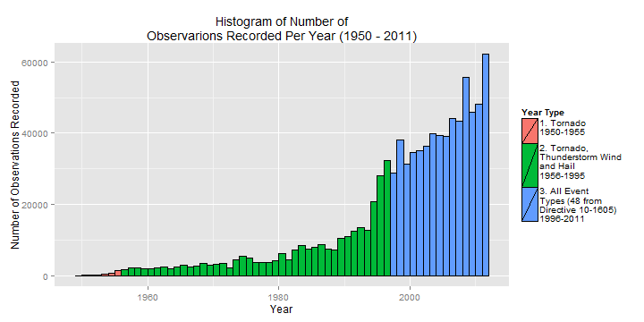

Reproducible Research: Peer Assessment 2
==========================================
Created by Simon Mackinnon on January 14, 2015
[Reproducable Research - Coursera](https://www.coursera.org/course/repdata)

## Economic and Public Health Effects of Storms and Other Severe Weather Events 

### Synopsis

The aim of this report is to analyse the storm database collected via the U.S. National Oceanic and Atmospheric Administration's (NOAA) from 1950 - 2011, and conclude the economic and health effects of different severe weather event types.  
The recorded data lists the number of fatalities, injuries, property and crop damage. These will be used to decide which types of event are most harmful to the population health and economy.  
In analysing the data, it was found that **tornadoes have the greatest detrimental effect on population health** and that **flood and drought have the greatest detremental economic effect**.  


### Settings

```r
options(scipen = 999) 
library(R.utils)
library(lubridate)
library(dplyr)
library(ggplot2)
library(grid)
library(gridExtra)
library(lazyeval)
```

### Data Processing
The data to be used for this analysis is available for download via the course website at [Storm Data](https://d396qusza40orc.cloudfront.net/repdata%2Fdata%2FStormData.csv.bz2).    


```r
zip_filename <- "./data/repdata-data-StormData.csv.bz2"
data_filename <- "./data/repdata-data-StormData.csv"

if (!file.exists("./data"))
{
  dir.create("./data")
}

if (!file.exists(data_filename))
{
  if (!file.exists(zip_filename))
  {
    url <- "http://d396qusza40orc.cloudfront.net/repdata%2Fdata%2FStormData.csv.bz2"
    #record the time/location of the downloaded file
    print (paste("Downloading file from:", url ,"at:", format(Sys.Date(), "%B %d, %Y"), format(Sys.time(), "%H:%M:%S")))
    #changed url to be http, as download file has issues with https
    
    download.file(url, 
                  destfile = zip_filename,
                  mode="wb")
  }
  
  bunzip2(zip_filename, overwrite=T, remove=F)
}

print ("Extracted data file information:")
```

```
## [1] "Extracted data file information:"
```

```r
print ("***************************************************************")
```

```
## [1] "***************************************************************"
```

```r
print (paste("Created on:", format(file.info(data_filename)$ctime, "%B %d, %Y %H:%M:%S")))
```

```
## [1] "Created on: January 13, 2015 17:17:01"
```

```r
print (paste("Modified on: ", format(file.info(data_filename)$mtime, "%B %d, %Y %H:%M:%S")))
```

```
## [1] "Modified on:  January 13, 2015 17:17:19"
```

```r
print ("***************************************************************")
```

```
## [1] "***************************************************************"
```

We now read the .csv into R.


```r
# this may take some time!
stormData <- read.csv(data_filename, 
                      header=TRUE, 
                      sep=",",
                      stringsAsFactors=FALSE)

#confirm the number dimensions of the read data
dim(stormData)
```

```
## [1] 902297     37
```

```r
#and display the head rows
head(stormData)
```

```
##   STATE__           BGN_DATE BGN_TIME TIME_ZONE COUNTY COUNTYNAME STATE
## 1       1  4/18/1950 0:00:00     0130       CST     97     MOBILE    AL
## 2       1  4/18/1950 0:00:00     0145       CST      3    BALDWIN    AL
## 3       1  2/20/1951 0:00:00     1600       CST     57    FAYETTE    AL
## 4       1   6/8/1951 0:00:00     0900       CST     89    MADISON    AL
## 5       1 11/15/1951 0:00:00     1500       CST     43    CULLMAN    AL
## 6       1 11/15/1951 0:00:00     2000       CST     77 LAUDERDALE    AL
##    EVTYPE BGN_RANGE BGN_AZI BGN_LOCATI END_DATE END_TIME COUNTY_END
## 1 TORNADO         0                                               0
## 2 TORNADO         0                                               0
## 3 TORNADO         0                                               0
## 4 TORNADO         0                                               0
## 5 TORNADO         0                                               0
## 6 TORNADO         0                                               0
##   COUNTYENDN END_RANGE END_AZI END_LOCATI LENGTH WIDTH F MAG FATALITIES
## 1         NA         0                      14.0   100 3   0          0
## 2         NA         0                       2.0   150 2   0          0
## 3         NA         0                       0.1   123 2   0          0
## 4         NA         0                       0.0   100 2   0          0
## 5         NA         0                       0.0   150 2   0          0
## 6         NA         0                       1.5   177 2   0          0
##   INJURIES PROPDMG PROPDMGEXP CROPDMG CROPDMGEXP WFO STATEOFFIC ZONENAMES
## 1       15    25.0          K       0                                    
## 2        0     2.5          K       0                                    
## 3        2    25.0          K       0                                    
## 4        2     2.5          K       0                                    
## 5        2     2.5          K       0                                    
## 6        6     2.5          K       0                                    
##   LATITUDE LONGITUDE LATITUDE_E LONGITUDE_ REMARKS REFNUM
## 1     3040      8812       3051       8806              1
## 2     3042      8755          0          0              2
## 3     3340      8742          0          0              3
## 4     3458      8626          0          0              4
## 5     3412      8642          0          0              5
## 6     3450      8748          0          0              6
```
There are **902297 rows** and **37 columns** in the read data.


### Data Selection and Filtering

Looking at the details of how the data was collected at the [Storm Events Database](http://www.ncdc.noaa.gov/stormevents/details.jsp), we can see that only observations from 1996 onward includes data from *All Event Types (48 from Directive 10-1605)*, (as defined in [NWS Directive 10-1605](http://www.ncdc.noaa.gov/stormevents/pd01016005curr.pdf)).  

We can verify that most of the observations were recorded after this date as well, by observing the frequency of observations per year in the **stormData$BGN_DATE** variable


```r
year <- year(as.Date(stormData$BGN_DATE, format = "%m/%d/%Y"))

#break up the year data into 3 types
yearType <- sapply(as.numeric(year), function(x) 
    if (x >= 1950 & x <= 1955){1} 
    else if (x <= 1996) {2} 
    else if (x <= 2011) {3}
    else {0})

#bind into a marix, then coerce to a data frame
yearData <- data.frame(cbind(year, yearType))

#create the histogram
ggplot(yearData, aes(x=year)) + 
geom_histogram(binwidth = 1, 
               aes(fill = factor(yearData$yearType)),
               colour = "black") +
scale_fill_discrete(name="Year Type", 
                    labels= c("1. Tornado\n1950-1955\n",
                              "2. Tornado,\nThunderstorm Wind\nand Hail\n1956-1995\n",
                              "3. All Event\nTypes (48 from\nDirective 10-1605)\n1996-2011")) +
labs(title = "Histogram of Number of\nObservarions Recorded Per Year (1950 - 2011)",
     x = "Year",
     y = "Number of Observations Recorded")
```



Based on this, we filter the data to only use observations from 1996 onward.


```r
#append the year values for filtering
stormData$year <- year
#subset the data for all values of year greater or equal to 1996
stormData <- stormData[stormData$year >= 1996,]
#display the dimensions of the filtered data
dim(stormData)
```

```
## [1] 653530     38
```
After filtering, there are **653530 rows** and **38 columns** in the filtered data.

### Results

#### Economic Effects

For the economic effects of severe weather, we must isolate what parts of the data define this.

Using the code book, ([Storm Events](http://ire.org/nicar/database-library/databases/storm-events/)), we can see that the columns PROPDMG and CROPDMG indicate the value of damage to property and crops respectively. Each of those columns is followed by a corresponding *EXP column, which indicates an exponent (H-Hundreds, K-Thousands, M-Millions, B-Billions). 

In order to aggregate the property and crop damage costs per event type, a common unit will need to be used (in this case, whole dollars.) In order to do this, two additional columns *propertyDamage* and *cropDamage* will be introduced, which will be the *DMG value multiplied by the appropriate *DMGEXP value.

From the following analysis, we can determine that **Flood** is the severe weather event type that has the greatest effect on the cost of Property Damage and that **Drought** has the greatest effect on the cost of Crop Damage.


```r
#subset data for crop damage cost, property damage cost (with exponents) and ev-type

stormDataEcon <- stormData[,c("EVTYPE", 
                              "PROPDMG", 
                              "PROPDMGEXP", 
                              "CROPDMG", 
                              "CROPDMGEXP")]

#create new vectors in the data frame
stormDataEcon$propertyDamage <- stormDataEcon$PROPDMG
stormDataEcon$cropDamage <- stormDataEcon$CROPDMG

#subset to rows only with damage
stormDataEcon <- stormDataEcon[stormDataEcon$PROPDMG != 0 | stormDataEcon$CROPDMG != 0,]

for (i in 1:nrow(stormDataEcon))
{
    if (stormDataEcon$PROPDMG[i] != 0)
    {
        if (stormDataEcon$PROPDMGEXP[i] == "H")
            stormDataEcon$propertyDamage[i] <- stormDataEcon$PROPDMG[i] * 10^2
        
        if (stormDataEcon$PROPDMGEXP[i] == "K")
            stormDataEcon$propertyDamage[i] <- stormDataEcon$PROPDMG[i] * 10^3
        
        if (stormDataEcon$PROPDMGEXP[i] == "M")
            stormDataEcon$propertyDamage[i] <- stormDataEcon$PROPDMG[i] * 10^6
        
        if (stormDataEcon$PROPDMGEXP[i] == "B")
            stormDataEcon$propertyDamage[i] <- stormDataEcon$PROPDMG[i] * 10^9    
    }
    
    if (stormDataEcon$CROPDMG[i] != 0)
    {
        if (stormDataEcon$CROPDMGEXP[i] == "H")
            stormDataEcon$cropDamage[i] <- stormDataEcon$CROPDMG[i] * 10^2
        
        if (stormDataEcon$CROPDMGEXP[i] == "K")
            stormDataEcon$cropDamage[i] <- stormDataEcon$CROPDMG[i] * 10^3
        
        if (stormDataEcon$CROPDMGEXP[i] == "M")
            stormDataEcon$cropDamage[i] <- stormDataEcon$CROPDMG[i] * 10^6
        
        if (stormDataEcon$CROPDMGEXP[i] == "B")
            stormDataEcon$cropDamage[i] <- stormDataEcon$CROPDMG[i] * 10^9
    }
}

#subset the relevant columns
stormDataEcon <- stormDataEcon[,c("EVTYPE",
                                  "propertyDamage",
                                  "cropDamage")]

stormDataEcon$EVTYPE <- factor(stormDataEcon$EVTYPE, 
                                   levels = stormDataEcon$EVTYPE)
```

```
## Warning in `levels<-`(`*tmp*`, value = if (nl == nL) as.character(labels)
## else paste0(labels, : duplicated levels in factors are deprecated
```

```r
#cost summation aggregrate by ev-type
economicImpactEventTypeAggregate <- aggregate(stormDataEcon,
                                              by = list(eventType = stormDataEcon$EVTYPE),
                                              FUN = function(x){sum(as.numeric(x))})

economicImpactEventTypeAggregate <- 
   economicImpactEventTypeAggregate[, c("eventType", 
                                        "propertyDamage",
                                        "cropDamage")]


#sort by totals
propertyDamageTop <- head(arrange(economicImpactEventTypeAggregate, 
                                             desc(propertyDamage)), 
                          n=15)

propertyDamageTop <- propertyDamageTop[,c("eventType", "propertyDamage")]
propertyDamageTop$eventType <- factor(propertyDamageTop$eventType, 
                                   levels = propertyDamageTop$eventType, 
                                   ordered = TRUE)

cropDamageTop <- head(arrange(economicImpactEventTypeAggregate, 
                                             desc(cropDamage)), 
                      n=15)

cropDamageTop <- cropDamageTop[,c("eventType", "cropDamage")]
cropDamageTop$eventType <- factor(cropDamageTop$eventType, 
                               levels = cropDamageTop$eventType, 
                               ordered = TRUE)

cropDamageTop
```

```
##            eventType  cropDamage
## 1            DROUGHT 13367566000
## 2              FLOOD  4974778400
## 3          HURRICANE  2741410000
## 4  HURRICANE/TYPHOON  2607872800
## 5               HAIL  2476029450
## 6        FLASH FLOOD  1334901700
## 7       EXTREME COLD  1288973000
## 8       FROST/FREEZE  1094086000
## 9         HEAVY RAIN   728169800
## 10    TROPICAL STORM   677711000
## 11         HIGH WIND   633561300
## 12         TSTM WIND   553915350
## 13    EXCESSIVE HEAT   492402000
## 14 THUNDERSTORM WIND   398331000
## 15          WILDFIRE   295472800
```

```r
propertyDamageTop
```

```
##            eventType propertyDamage
## 1              FLOOD   143944833550
## 2  HURRICANE/TYPHOON    69305840000
## 3        STORM SURGE    43193536000
## 4            TORNADO    24616945710
## 5        FLASH FLOOD    15222203910
## 6               HAIL    14595143420
## 7          HURRICANE    11812819010
## 8     TROPICAL STORM     7642475550
## 9          HIGH WIND     5247860360
## 10          WILDFIRE     4758667000
## 11  STORM SURGE/TIDE     4641188000
## 12         TSTM WIND     4478026440
## 13         ICE STORM     3642248810
## 14 THUNDERSTORM WIND     3382654440
## 15  WILD/FOREST FIRE     3001782500
```


```r
#plot dual plots

p1 <- qplot(eventType, 
            data = propertyDamageTop, 
            weight = propertyDamage, 
            binwidth = 1, 
            colour=I("blue"),
            fill=I("grey"),
            geom = "bar") +
  theme(axis.text.x = element_text(angle = 45, hjust = 1)) + 
  scale_y_continuous("Property Damage ($US)") + 
  xlab("Severe Weather Event Type") + 
  ggtitle("Property Damage Cost  vs\nSevere Weather Events Type\n(U.S. from 1995 - 2011)")

p2 <- qplot(eventType, 
            data = cropDamageTop, 
            weight = cropDamage, 
            binwidth = 1, 
            colour=I("blue"),
            fill=I("grey"),
            geom = "bar") +
  theme(axis.text.x = element_text(angle = 45, hjust = 1)) + 
  scale_y_continuous("Crop Damage ($US)") + 
  xlab("Severe Weather Event Type") + 
  ggtitle("Crop Damage Cost vs\nSevere Weather Events Type\n(U.S. from 1995 - 2011)")

grid.arrange(p1, p2, ncol = 2, main = "Economic Effects of Severe Weather Events")
```


#### Public Health Effects


For the health effects of severe weather, we must isolate what parts of the data define this.

Using the code book, ([Storm Events](http://ire.org/nicar/database-library/databases/storm-events/)), we can see that the columns INJURIES and FATALITIES indicate the number of injuries and fatalities caused by the event respectively. We will use these data characteristics to define the effect of severe weather events on public health.

From the following analysis, we can determine that **Tornado** is the severe weather event type that has the greatest effect on the number of injuries and on the number of fatalities.


```r
#subset data for injuries, fatalities and ev-type
stormDataHealth <- stormData[,c("EVTYPE", "INJURIES", "FATALITIES")]

stormDataHealth$EVTYPE <- factor(stormDataHealth$EVTYPE, 
                                   levels = stormDataHealth$EVTYPE)
```

```
## Warning in `levels<-`(`*tmp*`, value = if (nl == nL) as.character(labels)
## else paste0(labels, : duplicated levels in factors are deprecated
```

```r
#summation aggregrate by ev-type
healthImpactEventTypeAggregate <- aggregate(stormDataHealth,
                                            by = list(eventType = stormDataHealth$EVTYPE),
                                            FUN = function(x){sum(as.numeric(x))})


healthImpactEventTypeAggregate <- 
   healthImpactEventTypeAggregate[, c("eventType", 
                                        "INJURIES",
                                        "FATALITIES")]

#sort by totals
injuriesTop <- head(arrange(healthImpactEventTypeAggregate, desc(INJURIES)), n=15)
injuriesTop <- injuriesTop[,c("eventType", "INJURIES")]
injuriesTop$eventType <- factor(injuriesTop$eventType, levels = injuriesTop$eventType, ordered = TRUE)

fatalitiesTop <- head(arrange(healthImpactEventTypeAggregate, desc(FATALITIES)), n=15)
fatalitiesTop <- fatalitiesTop[,c("eventType", "FATALITIES")]
fatalitiesTop$eventType <- factor(injuriesTop$eventType, levels = injuriesTop$eventType, ordered = TRUE)

injuriesTop
```

```
##            eventType INJURIES
## 1            TORNADO    20667
## 2              FLOOD     6758
## 3     EXCESSIVE HEAT     6391
## 4          LIGHTNING     4141
## 5          TSTM WIND     3629
## 6        FLASH FLOOD     1674
## 7  THUNDERSTORM WIND     1400
## 8       WINTER STORM     1292
## 9  HURRICANE/TYPHOON     1275
## 10              HEAT     1222
## 11         HIGH WIND     1083
## 12          WILDFIRE      911
## 13              HAIL      713
## 14               FOG      712
## 15        HEAVY SNOW      698
```

```r
fatalitiesTop
```

```
##            eventType FATALITIES
## 1            TORNADO       1797
## 2              FLOOD       1511
## 3     EXCESSIVE HEAT        887
## 4          LIGHTNING        651
## 5          TSTM WIND        414
## 6        FLASH FLOOD        340
## 7  THUNDERSTORM WIND        241
## 8       WINTER STORM        237
## 9  HURRICANE/TYPHOON        235
## 10              HEAT        223
## 11         HIGH WIND        202
## 12          WILDFIRE        191
## 13              HAIL        130
## 14               FOG        125
## 15        HEAVY SNOW        113
```


```r
#plot dual plots
p3 <- qplot(eventType, 
            data = injuriesTop, 
            weight = INJURIES, 
            binwidth = 1, 
            colour=I("blue"),
            fill=I("grey"),
            geom = "bar") +
  theme(axis.text.x = element_text(angle = 45, hjust = 1)) + 
  scale_y_continuous("Number of Injuries") + 
  xlab("Severe Weather Event Type") + 
  ggtitle("Number of Injuries  vs\nSevere Weather Events Type\n(U.S. from 1995 - 2011)")

p4 <- qplot(eventType, 
            data = fatalitiesTop, 
            weight = FATALITIES, 
            binwidth = 1, 
            colour=I("blue"),
            fill=I("grey"),
            geom = "bar") +
  theme(axis.text.x = element_text(angle = 45, hjust = 1)) + 
  scale_y_continuous("Number of Fatalities") + 
  xlab("Severe Weather Event Type") + 
  ggtitle("Number of Fatalities  vs\nSevere Weather Events Type\n(U.S. from 1995 - 2011)")

grid.arrange(p3, p4, ncol = 2, main = "Health Effects of Severe Weather Events")
```


### Conclusion

Based on the above results, we can conclude that **tornado** is the severe weather most harmful with respect to population health, and that **flood** and **drought** have the greatest economic consequences.

